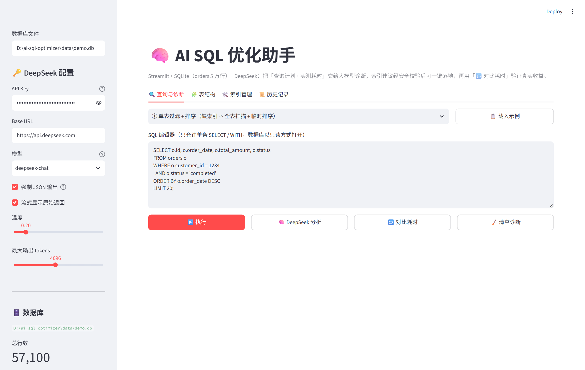
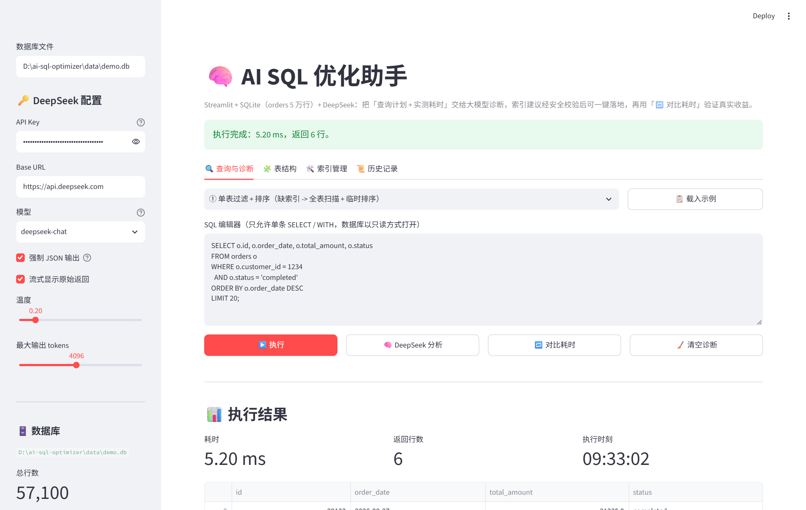
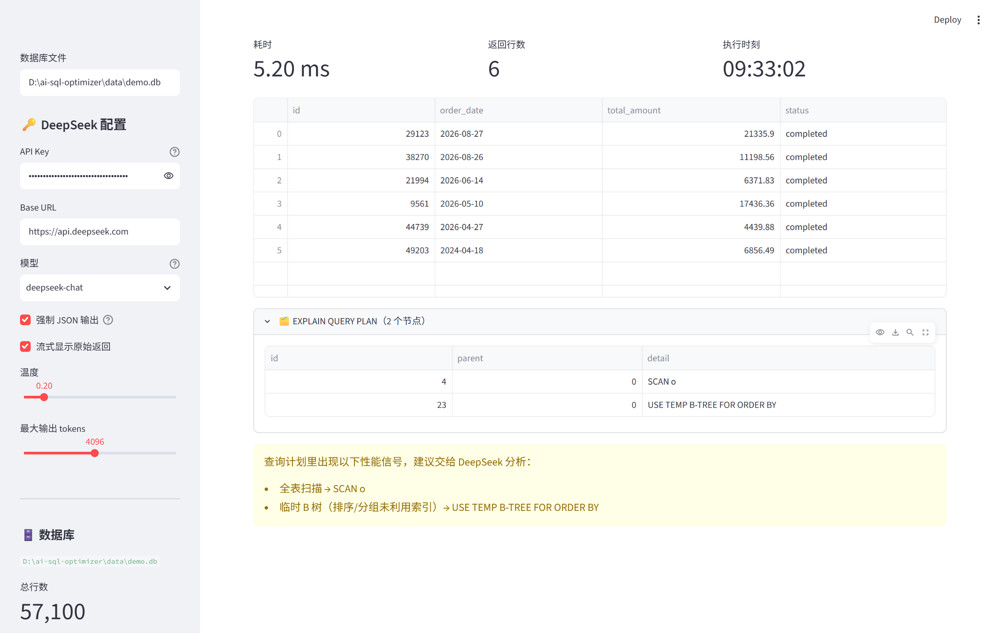
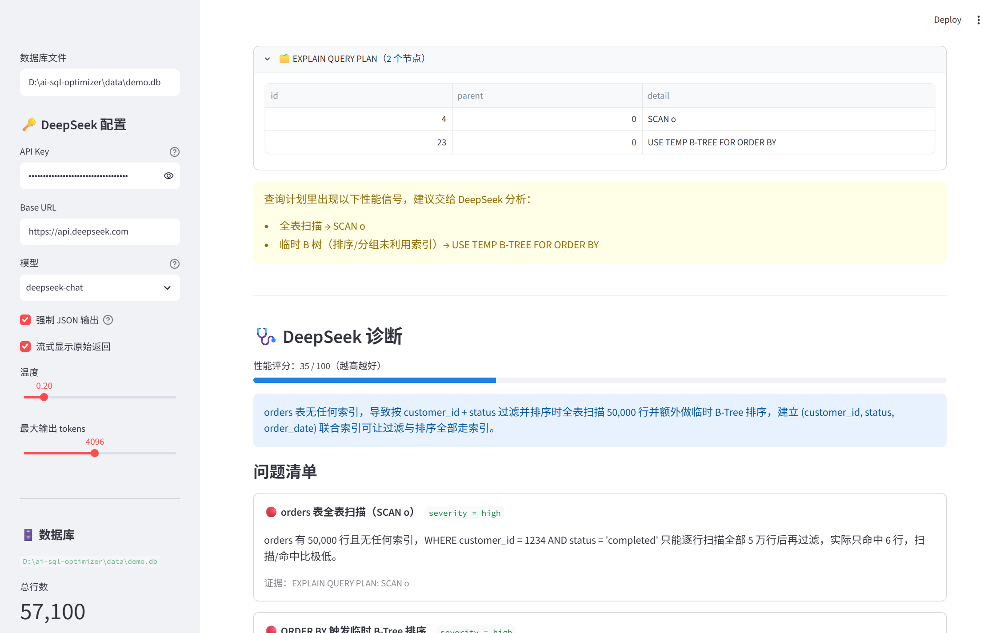
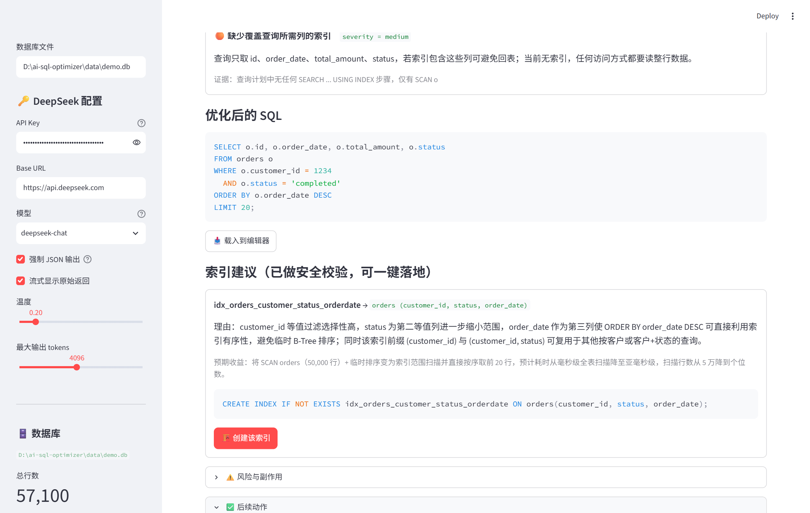
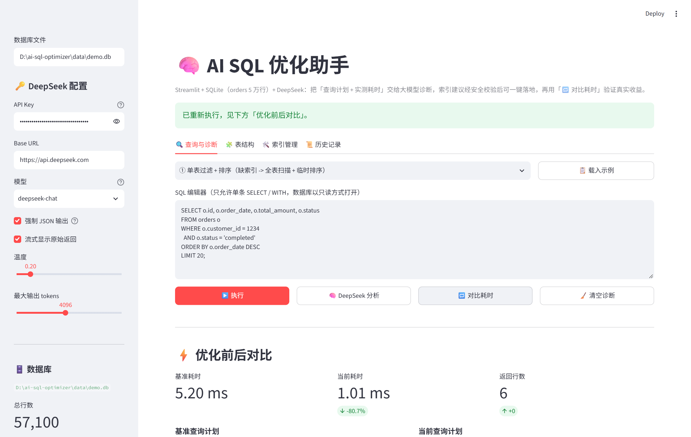
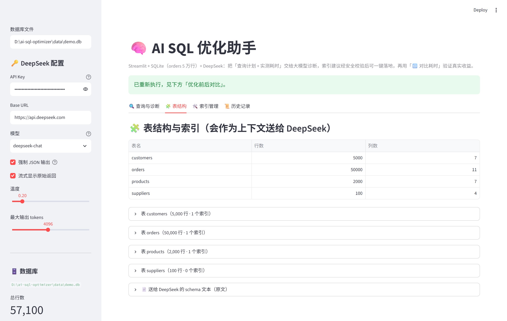
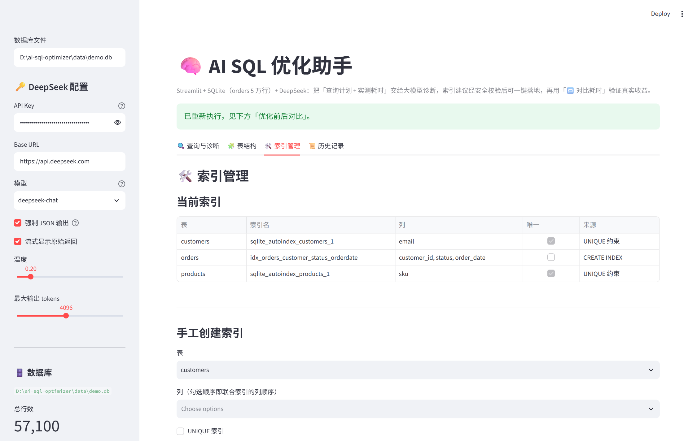
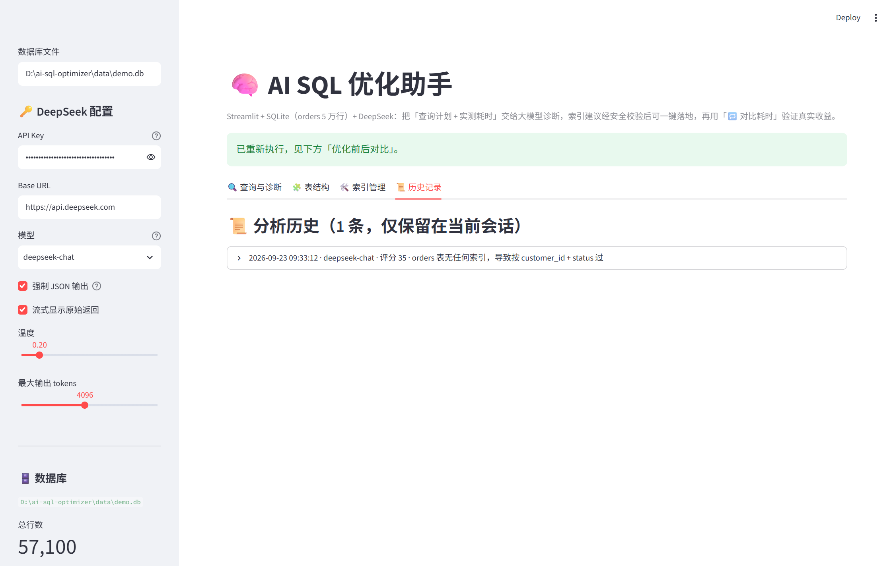

# 🧠 AI SQL 优化助手（Streamlit + SQLite + DeepSeek）

一个「可选、可验证、可解释」的 SQL 性能优化演示工具：

1. 在网页里写一条 **SELECT**；
2. 工具在本地 5 万行 SQLite 库上真的执行它，测出 **真实耗时** 并抓取 `EXPLAIN QUERY PLAN`；
3. 把这些客观证据（schema + SQL + 查询计划 + 实测耗时 + 结果样例）交给 **DeepSeek** 诊断，得到 **问题清单 / 重写后的 SQL / 索引建议 / 风险提示**；
4. 索引建议经 **安全校验** 后可 **一键落地**，再点「🔁 对比耗时」用 **加索引前后的真实数字** 证明优化是否有效。

> 核心理念：**LLM 负责提出假设，SQLite 负责给出证据。** 任何优化建议都必须能被「查询计划变化 + 实测耗时」证实或证伪。

---

## 1. 功能一览

| 页签 | 能力 |
| --- | --- |
| 🔍 查询与诊断 | SQL 编辑器（5 条预置示例）、执行并计时、查看执行计划与性能信号、一键 DeepSeek 诊断、索引一键落地、优化前后耗时/计划对比 |
| 🧩 表结构 | 4 张表的行数、列清单（标注是否已被索引覆盖）、现有索引及来源、以及「送给 LLM 的 schema 原文」 |
| 🛠️ 索引管理 | 查看/手工创建/删除索引、一键重置演示库（回到「只有主键/UNIQUE 索引」的初始状态） |
| 📜 历史记录 | 本次会话的分析记录（SQL、评分、摘要、建议索引、原始 JSON），可一键载回编辑器 |

### 界面截图

> 下面全部是**真实运行截图**（Playwright 驱动本机 Edge 抓取真实页面，非设计稿）：耗时是 SQLite 实测值，执行计划是 `EXPLAIN QUERY PLAN` 原样输出，诊断内容为 DeepSeek 真实返回（2026-09-23，`orders` 5 万行）。

**① 查询与诊断闭环：写 SQL → 执行 → 交给 DeepSeek 诊断 → 落地索引 → 对比耗时**

| 首屏：SQL 编辑器 + 5 条预置示例 | 执行结果：实测耗时 / 返回行数 / 数据预览 |
| --- | --- |
|  |  |

| 执行计划 + 自动识别性能信号 | DeepSeek 诊断：性能评分 + 问题清单 |
| --- | --- |
|  |  |

| 重写后的 SQL + 索引建议（含待执行 DDL） | 「对比耗时」给出加索引前后的真实收益 |
| --- | --- |
|  |  |

**② 其余三个页签**

| 🧩 表结构（标注索引覆盖情况） | 🛠️ 索引管理（AI 落地的索引 / 手工创建 / 重置） | 📜 历史记录（会话内诊断留档） |
| --- | --- | --- |
|  |  |  |

> 想自己重抓这批截图？`python -m pip install playwright` 后执行 `python -X utf8 tools/capture_screenshots.py`（会真实启动应用并调用一次 DeepSeek，跑完请用 `python db_setup.py --force` 还原演示库）。

---

## 2. 目录结构

```
ai-sql-optimizer/
├── app.py              # Streamlit 主程序（安全校验 / 执行 / 索引 / DeepSeek / UI）
├── db_setup.py         # 演示库生成器 + 数据访问层（只读连接、schema/索引/行数）
├── requirements.txt    # 依赖
├── .env.example        # DeepSeek 配置模板
├── data/demo.db        # 生成的 SQLite 演示库（约 4.1 MB，57,100 行）
├── docs/images/        # README 界面截图（9 张真实运行截图）
├── tools/              # 可选开发工具（capture_screenshots.py：重抓上面这些图）
└── README.md
```

> `.env` 与 `data/*.db` 已写入 `.gitignore`：克隆仓库后先执行 `python db_setup.py --force` 生成演示库，再启动页面即可。

---

## 3. 演示数据库设计（为什么它适合演示优化）

| 表 | 行数 | 说明 |
| --- | --- | --- |
| `suppliers` | 100 | 供应商维度 |
| `customers` | 5,000 | 客户维度（`email` 有 UNIQUE 索引） |
| `products` | 2,000 | 商品维度（`sku` 有 UNIQUE 索引） |
| `orders` | **50,000** | 订单事实表（**题目要求的 5 万条数据**） |

建库时 **故意只给主键和 UNIQUE 列建索引**，`orders.customer_id`、`orders.product_id`、`orders.order_date`、`orders.status`、`products.category` 等高频过滤/连接列 **全部保持无索引**，因此：

- `EXPLAIN QUERY PLAN` 会真实出现 `SCAN o`、`SCAN products`、`USE TEMP B-TREE FOR ORDER BY/GROUP BY`；
- DeepSeek 提出的「加索引」建议 **可被验证**（加索引 → 计划变成 `SEARCH ... USING INDEX` → 耗时下降）。

数据由固定随机种子（`20240101`）生成，任何人重建都得到同一份数据，演示可复现；建库结束后会执行 `ANALYZE` 生成 `sqlite_stat1`，让查询计划更贴近真实工程环境。

---

## 4. 环境与安装

已验证环境：**Python 3.14.0 / streamlit 1.64.0 / pandas 3.0.6 / openai 3.16.2 / python-dotenv 1.2.3**。

```powershell
cd d:\ai-sql-optimizer

# 1) 安装依赖（如已装可跳过）
python -m pip install -r requirements.txt

# 2) 生成演示库（5.7 万行，约 1 秒）
python db_setup.py --force
#    常用参数：
#      --orders 200000   自定义 orders 行数（压测演示用）
#      --seed 12345      换一份数据
#      --print-schema    只打印送给 LLM 的 schema 文本

# 3) 启动网页
python -m streamlit run app.py
```

浏览器会自动打开 `http://localhost:8501`。

### 配置 DeepSeek

复制 `.env.example` 为 `.env` 并填写：

```ini
DEEPSEEK_API_KEY=sk-xxxxxxxxxxxxxxxxxxxxxxxx
DEEPSEEK_BASE_URL=https://api.deepseek.com
DEEPSEEK_MODEL=deepseek-chat
```

`.env` 会被自动加载（也可直接在左侧栏的输入框里粘贴 Key，页面优先使用输入框的值）。模型可选 `deepseek-chat`（快、支持 `response_format=json_object`）或 `deepseek-reasoner`（会额外展示思维链 `reasoning_content`）。

---

## 5. 推荐演示动线（3 分钟讲完一套闭环）

1. **制造问题**：选示例 ① → `SELECT ... FROM orders WHERE customer_id = 1234 AND status = 'completed' ORDER BY order_date DESC LIMIT 20`，点「▶️ 执行」。看到 `SCAN o` + `USE TEMP B-TREE FOR ORDER BY`，耗时约 5 ms（数据量再大就会线性变差）。
2. **让 AI 诊断**：点「🧠 DeepSeek 分析」。它会读到 schema、SQL、查询计划、实测耗时与结果样例，返回问题清单、评分、重写 SQL 与索引建议。
3. **落地建议**：在索引卡片上点「🏗️ 创建该索引」，工具会先校验表名/列名真实存在再执行 DDL（同时 `ANALYZE` 刷新统计）。
4. **用数字打脸或点赞**：点「🔁 对比耗时」。查询计划变成 `SEARCH o USING INDEX ... (customer_id=? AND status=?)`，耗时从 ~4.8 ms 降到 ~0.7 ms。
5. **收尾**：在「🛠️ 索引管理」里删除索引或一键重建演示库，回到初始状态。

---

## 6. 实测数据（本仓库 2026-09-23 在 5 万行 `orders` 上跑出的真实结果）

| 场景 | 变更 | 查询计划 | 耗时变化 |
| --- | --- | --- | --- |
| ① 单表过滤 + 排序 | 建复合索引 `orders(customer_id, status, order_date)` | `SCAN o` → `SEARCH o USING INDEX (customer_id=? AND status=?)` | 4.80 ms → **0.71 ms（-85.3%）** |
| ② JOIN + 90 天范围聚合 | 只建 `orders(order_date)` | `SCAN o` → `SEARCH o USING INDEX`（仍需回表） | 12.11 ms → **34.00 ms（+180.9%，变慢）** |
| ② 的改进版 | 建 **覆盖索引** `orders(order_date, customer_id, total_amount)` | → `SEARCH o USING COVERING INDEX` | 11.67 ms → **6.40 ms（-45.1%）** |
| ④ 列被函数包裹 | 改写为范围条件 + 建 `orders(order_date)` | `SCAN orders` → `SEARCH orders USING INDEX (order_date>? AND order_date<?)` | 13.20 ms → **7.56 ms（-42.7%）** |

**第 2 行是关键的教学点**：范围条件命中比例高（约 25% 行）时，走索引「回表」的随机读可能比全表顺序扫描更慢。工具不会隐藏这一点——「🔁 对比耗时」发现耗时上升会直接给出黄色警告，并提示「索引选择性不足，可考虑删除」，可通过「🛠️ 索引管理」立刻回滚。这也是「不要盲信 LLM 建议」的最好证明。

---

## 7. 工作原理与安全设计

### 7.1 三层只读防护（用户 SQL 永远不会改数据）

1. 连接层：`file:...?mode=ro`（对中文/空格路径做 URL 编码）+ `PRAGMA query_only = ON`；
2. 文本层：只放行单条 `SELECT` / `WITH`；先剥离注释与字符串字面量，再拒绝分号分隔的多语句与写关键字（`INSERT/UPDATE/DELETE/CREATE/DROP/ALTER/ATTACH/PRAGMA/VACUUM/...`）；长度上限 20,000 字符；
3. 索引 DDL 走独立可写连接，只执行 `CREATE INDEX` / `DROP INDEX`，不做任何数据变更。

### 7.2 测量方法

- 计时前先 **预热执行一次**（`warm_cache`），排除 SQLite 页缓存冷启动带来的失真；
- 单次执行最多取回 20,000 行（`FETCH_LIMIT`）防止 `SELECT *` 打爆内存，页面表格只渲染前 200 行（`PREVIEW_ROWS`）；
- 执行与 `EXPLAIN QUERY PLAN` 分别取值，前后对比时同时展示**耗时**与**计划差异**（计划才是可迁移到生产环境的证据）。

### 7.3 LLM 输出不可信 → 全部结构化校验

- 要求模型返回固定 JSON（`summary / score / issues / optimized_sql / indexes / risks / next_steps`），解析失败时保留原始返回供人工查看；
- 模型给的 `CREATE INDEX` DDL **不会直接执行**：先用正则解析成 `表 / 列 / 唯一性`，再校验表与列确实存在、标识符合法；解析失败则退回用结构化字段重建 DDL；表达式索引、排序方向、`COLLATE` 等不可控写法一律拒绝并标注「不可执行」；
- 重写后的 SQL 也不会自动执行，需要你先「📥 载入到编辑器」再手动跑（避免误伤）。

### 7.4 索引名称与缓存

- 索引名由 `idx_表名_列名` 自动生成（超 63 字符截断），`CREATE INDEX IF NOT EXISTS` 幂等；
- schema/索引/行数信息用 `st.cache_data` 缓存，索引变更后通过 `schema_version += 1` 自动失效，保证页面永远显示最新状态。

---

## 8. 常见问题

**Q：提示「请先在侧边栏填写 DeepSeek API Key」？**
填写左侧栏输入框，或把 Key 写进项目根目录 `.env` 的 `DEEPSEEK_API_KEY` 后重启页面。

**Q：报 401 / 429 / 连接失败？**
401 = Key 无效；429 = 限流或额度不足；连接失败通常是网络或 `DEEPSEEK_BASE_URL` 配置问题（如走代理网关需改成对应地址）。

**Q：模型返回无法解析成 JSON？**
`deepseek-chat` 请保持侧栏「强制 JSON 输出」勾选；若仍失败，可把「温度」调到 0.0 并适当提高「最大输出 tokens」，原始返回会在诊断区展开可查。

**Q：为什么我加的索引让查询更慢了？**
见第 6 节第 2 行。范围条件命中行数多、或查询需要回表取其他列时，索引可能不划算。实践中优先考虑：高选择性列、复合索引前缀、**覆盖索引**；本工具支持在「🛠️ 索引管理」里删除不合适索引。

**Q：数据被我改乱了想重来？**
「🛠️ 索引管理」→「♻️ 覆盖重建演示库」；命令行则 `python db_setup.py --force`。

**Q：控制台出现 `use_container_width` 之类警告？**
本仓库已统一使用 streamlit 1.64 推荐写法（`width="stretch"`）。若你用的是更老的 streamlit，请升级：`python -m pip install -U streamlit`。

---

## 9. 可扩展方向

- 接入 `sqlite3` 之外的数据源（PostgreSQL / MySQL 的 `EXPLAIN ANALYZE`）：只需替换 `db_setup.py` 的数据访问层；
- 增加「慢查询基准集」批量跑分：对同一批 SQL 记录加索引前后的耗时表；
- 让模型输出「成本对比」而不是单条建议，并自动计算索引维护代价（写入放大、存储开销）；
- 把每次诊断结果落库（当前只保存在会话内），形成项目级优化知识库。
